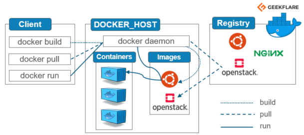

<a name="top"></a>
[<<README](../README.md)
  
# Introducción a Docker

## Contenidos:
1. [¿Qué es Docker?](#tiulo1)
2. [Ventajas de usar Docker](#titulo2)
3. [Características de Docker](#titulo3)
4. [Componentes de Docker](#titulo4)
5. [Caso práctico: Instalando Docker](#titulo5)
6. [Comandos más habituales para la gestión de contenedores](#titulo6)

<a name="titulo1"></a>
## 1. ¿Qué es Docker?
**[Docker](https://www.docker.com/)** es un software de código abierto utilizado para desplegar aplicaciones dentro de contenedores virtuales. La contenerización permite que varias aplicaciones funcionen en diferentes entornos complejos. Por ejemplo, Docker permite ejecutar el sistema de gestión de contenidos WordPress en sistemas Windows, Linux y macOS sin ningún problema. 

Docker es una tecnología de organización en contenedores que posibilita la creación y el uso de los contenedores de Linux.
 

Docker es un proyecto de código abierto para automatizar la implementación de aplicaciones como contenedores portátiles y autosuficientes que se pueden ejecutar en la nube o localmente. Docker es también una empresa que promueve e impulsa esta tecnología, en colaboración con proveedores de la nube, Linux y Windows, incluido Microsoft.

<a name="titulo2"></a>
## 2. Ventajas de usar Docker
Docker proporciona entornos repetibles de desarrollo, construcción, prueba y producción. La estandarización de la infraestructura de servicio en todo el proceso permite que cada miembro del equipo trabaje en un entorno de paridad de producción. 

Una de las ventajas principales de Docker es la forma en la que simplifica las cosas. Los desarrolladores pueden coger su propia configuración, transformarlo en código y desplegarlo sin problemas. 

Docker te permite construir una imagen de contenedor y usar esa misma imagen en cada paso del proceso de implementación. Una gran ventaja de esto es la capacidad de separar los pasos no dependientes y ejecutarlos en paralelo. El tiempo que lleva desde la construcción hasta la producción puede acelerarse notablemente.

Las principales características qie nos pueden llevar a escoger Docker frente a máquinas virtuales son:
- Permite la creación de contenedores que son unidades estandarizadas de software que incluyen todo lo necesario para que una aplicación se ejecute, incluidas las bibliotecas y las herramientas del sistema.
- Los contenedores son portátiles y se pueden mover fácilmente entre diferentes sistemas operativos y plataformas.
- Docker es compatible con la mayoría de los lenguajes de programación y marcos de trabajo.
- Los contenedores son más ligeros y rápidos que las máquinas virtuales porque no necesitan un sistema operativo completo para funcionar.


<a name="titulo3"></a>
## 3. Características de Docker
Las principales características clave que ofrece Docker son:

- **Ligero:** Los contenedores de Docker son ligeros y rápidos en comparación con las máquinas virtuales tradicionales. Esto se debe a que comparten el mismo núcleo del sistema operativo del host, lo que reduce la sobrecarga y el consumo de recursos.
- **Portable:** Los contenedores de Docker son portátiles, lo que significa que se pueden ejecutar en cualquier entorno, ya sea localmente en un portátil o en la nube. Esto facilita la implementación de aplicaciones en diferentes entornos sin tener que preocuparse por las diferencias de configuración.
- **Inmutable:** Docker promueve la idea de la inmutabilidad, lo que significa que una vez que un contenedor se crea y se ejecuta, no se debe realizar ningún cambio en él. En lugar de modificar un contenedor en ejecución, se crea una nueva versión actualizada. Esto garantiza la consistencia y la estabilidad de las aplicaciones.
- **Escalable:** Docker permite escalar fácilmente aplicaciones distribuidas en múltiples contenedores. Puede aumentar o disminuir el número de contenedores según las necesidades de carga de trabajo, lo que facilita la administración de aplicaciones en entornos de alta demanda.
- **Seguro:** Docker proporciona un entorno seguro para las aplicaciones al aislarlas en contenedores individuales. Cada contenedor tiene su propio sistema de archivos y recursos, lo que evita que las aplicaciones interfieran entre sí. Además, Docker ofrece características de seguridad adicionales, como la autenticación y el control de acceso, para proteger los contenedores y los datos que contienen.


<a name="titulo4"></a>
## 4. Componentes de Docker
A continuación, se muestra un diagrama de los componentes principales de Docker.


Los componentes principales de Docker son: Cliente, Motor y Registro.
Estos tres componentes trabajan en conjunto para permitir la creación, ejecución y distribución de contenedores con Docker. El cliente de Docker envía comandos al motor de Docker, que a su vez se encarga de gestionar los contenedores y acceder al registro de Docker para obtener las imágenes necesarias.

### Cliente de Docker
Es la interfaz de línea de comandos (CLI) que permite a los usuarios interactuar con el entorno de Docker. El cliente de Docker se comunica con el motor de Docker para ejecutar comandos y administrar contenedores, imágenes y volúmenes.

### Motor de Docker (*Docker Engine*)
Es el componente central de Docker que ejecuta y gestiona los contenedores. El motor de Docker se encarga de construir, ejecutar y distribuir los contenedores. También administra los recursos del sistema, como la memoria y la CPU, para garantizar un rendimiento óptimo de los contenedores.

Las imágenes y los contenedores son dos conceptos fundamentales en Docker:

#### Contenedores
Un contenedor de Docker es una instancia en ejecución de una imagen de Docker. Los contenedores se crean a partir de imágenes y contienen todo lo necesario para ejecutar una aplicación de forma aislada, incluyendo el sistema operativo, las bibliotecas y las configuraciones necesarias. Cada contenedor se ejecuta de manera independiente y aísla los procesos y recursos del sistema del host y de otros contenedores. Los contenedores son livianos, portátiles y escalables, y pueden ser fácilmente iniciados, detenidos, reiniciados y eliminados.


#### Imágenes
Una imagen de Docker es una plantilla o un archivo de solo lectura que contiene todo lo necesario para ejecutar una aplicación, incluyendo el código, las bibliotecas, las dependencias, las variables de entorno y cualquier otro archivo o configuración necesarios. Las imágenes se construyen a partir de un archivo de configuración llamado Dockerfile, que especifica las instrucciones para construir la imagen. Las imágenes se pueden considerar como una instantánea del estado de una aplicación en un momento dado.

### Registro
Es un repositorio centralizado donde se almacenan las imágenes de Docker. El registro de Docker permite a los usuarios compartir y distribuir imágenes de contenedores. Docker Hub es el registro de Docker público más conocido, pero también se pueden utilizar registros privados para almacenar imágenes personalizadas.

Algunos ejemplos de registros de Docker son:

- **[Docker Hub:](https://hub.docker.com/)** Es el registro de Docker público más conocido y utilizado. Proporciona una amplia variedad de imágenes de contenedores, tanto oficiales como de la comunidad. Docker Hub permite a los usuarios subir, descargar y compartir imágenes de contenedores de forma gratuita.
- **[Amazon Elastic Container Registry (ECR):](https://aws.amazon.com/es/ecr/)** Es un servicio de registro de Docker proporcionado por Amazon Web Services (AWS). ECR permite a los usuarios almacenar, administrar y desplegar imágenes de contenedores en la nube de AWS. Es altamente escalable y se integra bien con otros servicios de AWS, como Amazon ECS y Amazon EKS.
- **[Google Container Registry (GCR):](https://cloud.google.com/artifact-registry?hl=es)** Es un registro de Docker proporcionado por Google Cloud Platform (GCP). GCR permite a los usuarios almacenar y administrar imágenes de contenedores en la nube de GCP. También se integra con otras herramientas y servicios de GCP, como Google Kubernetes Engine (GKE).
- **[Azure Container Registry (ACR):](https://azure.microsoft.com/es-es/products/container-registry)** Es un servicio de registro de Docker proporcionado por Microsoft Azure. ACR permite a los usuarios almacenar y administrar imágenes de contenedores en la nube de Azure. Se integra con otros servicios de Azure, como Azure Kubernetes Service (AKS) y Azure Container Instances.

Estos son solo algunos ejemplos de registros de Docker populares, pero también es posible configurar y utilizar registros privados para almacenar y compartir imágenes de contenedores personalizadas.

<a name="titulo5"></a>
## 5. Caso práctico: Instalando Docker
Para instalar Docker, sigue estos pasos:

1. **Comprueba los requisitos del sistema:** Antes de instalar Docker, asegúrate de que tu sistema cumpla con los requisitos mínimos. Docker es compatible con una variedad de sistemas operativos, incluyendo Linux, Windows y macOS. Verifica que tu sistema cumpla con los requisitos de hardware y software necesarios para la instalación de Docker.

2. **Descarga Docker:** Visita el [sitio web oficial de Docker](https://www.docker.com/) y descarga la versión adecuada para tu sistema operativo. Asegúrate de descargar la versión estable y recomendada de Docker.

3. **Instala Docker:** Una vez que hayas descargado el archivo de instalación de Docker, ejecútalo y sigue las instrucciones del asistente de instalación. Durante la instalación, se te puede pedir que aceptes los términos y condiciones de uso, así como proporcionar permisos de administrador.

4. **Inicia Docker:** Una vez completada la instalación, inicia Docker desde el menú de aplicaciones o desde la línea de comandos. En algunos sistemas operativos, Docker se iniciará automáticamente después de la instalación.

5. **Verifica la instalación:** Para asegurarte de que Docker se ha instalado correctamente, abre una ventana de terminal o línea de comandos y ejecuta el comando `docker version`. Esto mostrará la versión de Docker instalada y confirmará que la instalación se ha realizado correctamente.

### Instalación de Docker en Ubuntu / Linux Mint
Para instalar Docker en Ubuntu, puedes seguir los siguientes pasos:

1. Actualiza el índice de paquetes de Ubuntu:

```
sudo apt update
```

2. Instala algunos paquetes de requisitos previos que permiten a apt usar paquetes a través de HTTPS:

```
sudo apt install apt-transport-https ca-certificates curl software-properties-common
```

3. Agrega la clave GPG oficial de Docker:

```
curl -fsSL https://download.docker.com/linux/ubuntu/gpg | sudo gpg --dearmor -o /usr/share/keyrings/docker-archive-keyring.gpg
```

4. Configura el repositorio estable de Docker:

```
echo "deb [arch=amd64 signed-by=/usr/share/keyrings/docker-archive-keyring.gpg] https://download.docker.com/linux/ubuntu $(lsb_release -cs) stable" | sudo tee /etc/apt/sources.list.d/docker.list > /dev/null
```

5. Actualiza el índice de paquetes nuevamente:

```
sudo apt update
```

6. Instala Docker Engine:

```
sudo apt install docker-ce docker-ce-cli containerd.io
```

7. Verifica que Docker se haya instalado correctamente ejecutando el siguiente comando:

```
sudo docker run hello-world
```
Si ves un mensaje que indica "Hello from Docker!", significa que Docker se ha instalado correctamente en tu sistema.

Una vez Docker está instalado en el sistema y estás podemos comenzar a utilizarlo para crear, ejecutar y administrar contenedores.

<a name="titulo6"></a>
## 6. Comandos más habituales para la gestión de contenedores
El comando básico para obtener infromación dellada de los comandos de Docker es `docker --help`.

Para gestionar contenedores emplearemos:
**Uso:** `docker container COMANDO`
**Comandos:**
  - `attach`: Adjuntar flujos locales de entrada, salida y error estándar a un contenedor en ejecución.
  - `commit`: Crear una nueva imagen a partir de los cambios de un contenedor.
  - `cp`: Copiar archivos/carpetas entre un contenedor y el sistema de archivos local.
  - `create`: Crear un nuevo contenedor.
  - `diff`: Inspeccionar cambios en archivos o directorios en el sistema de archivos de un contenedor.
  - `exec`: Ejecutar un comando en un contenedor en ejecución.
  - `export`: Exportar el sistema de ficheros de un contenedor como archivo *tar*.
  - `inspect`: Mostrar información detallada sobre uno o más contenedores.
  - `kill`: Matar uno o más contenedores en ejecución.
  - `logs`: Obtener los registros de un contenedor.
  - `ls`: Listar contenedores.
  - `pause`: Pausa todos los procesos de uno o más contenedores.
  - `port`: Lista las asignaciones de puertos o una asignación específica para el contenedor
  - `prune`: Elimina todos los contenedores detenidos.
  - `rename`: Renombra un contenedor.
  - `restart`: Reinicia uno o más contenedores.
  - `rm`: Eliminar uno o más contenedores.
  - `run`:` Crear y ejecutar un nuevo contenedor desde una imagen.
  - `start`: Iniciar uno o más contenedores parados.
  - `stats`: Mostrar en tiempo real las estadísticas de uso de recursos de los contenedores.
  - `stop`: Detener uno o más contenedores en ejecución.
  - `top`: Mostrar los procesos en ejecución de un contenedor.
  - `unpause`: Desactivar todos los procesos de uno o más contenedores.
  - `update`: Actualizar la configuración de uno o más contenedores.
  - `wait`: Bloquear hasta que uno o más contenedores se detengan.

## Videos
- [¿Qué es un contenedor Docker?](https://youtu.be/m8TdvyooQ2g?list=PLOV9_oYpKEH47KTEpXwEKkEAxc4ZJ1VGA)
- [Docker sencillo: Introducción.](https://youtu.be/2MZbEHIw5FE?list=PLrb1e2Mp6N_s898B-37mcbI00aJ5gmwLm)
- [Docker vs Máquinas Virtuales](https://youtu.be/HysQjh7c3j0?list=PLrb1e2Mp6N_tXQryuDVzOq4SLQKqVv1uz)

## Ejercicios propuestos:
1. Explique resumidamente qué es Docker.
2. ¿Cual es la diferencia entre Docker y una máquina virtual?
3. Averigue cual es la versión de Docker que tiene instalada en su sistema operativo.
4. ¿Cuál es la diferencia entre *Docker Server Engine* y *Docker Client Engine*?
5. Ejecute los siguientes comandos:
```bash
docker run hello-world
```
Cuestiones:
    - ¿Cual es el resultado de la ejecución del contenedor *hello-world*?
    - ¿Cual es el tamaño de la imagen descargada?
     
## Referencias:
- [Docker: Accelerated Container Application Development](https://www.docker.com/)
- [¿Qué es Docker y cómo funciona? - Red Hat.](https://www.redhat.com/es/topics/containers/what-is-docker)
- [Los beneficios de utilizar Docker y contenedores a la hora de programar.](https://www.campusmvp.es/recursos/post/)
- [Arquitectura Docker y sus componentes principales para principiantes.](https://geekflare.com/es/docker-architecture/)]
- [Docker Hub: *Build, Ship and Run, any app anywhere*.](https://hub.docker.com/)
- [Documentación oficial de Docker para la instalación en Ubuntu.](https://docs.docker.com/engine/install/ubuntu/)
- [Guía de DigitalOcean para instalar Docker en Ubuntu.](https://www.digitalocean.com/community/tutorials/how-to-install-and-use-docker-on-ubuntu-20-04-es)
[Subir](#top)

[Preparación de contenedores mediante comnados >](L02_Contenedor_comandos.md)