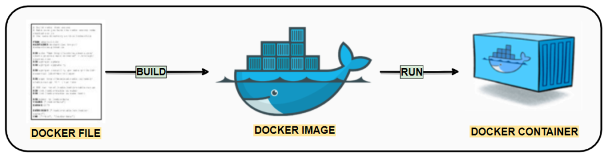

# Construcción de imagenes: `docker build` y  *Dockerfile*.
## Contenidos:
1. Docker build.
2. Dockerfile.
3. Optimización de Dockerfile.


Docker Build y Dockerfile son dos componentes clave en el proceso de construcción de imágenes de contenedores personalizadas en Docker. A continuación, se explica el funcionamiento de cada uno:


## 1. Docker build
**Docker Build** es el comando utilizado para construir una imagen de contenedor a partir de un Dockerfile y otros recursos necesarios. Este comando toma como entrada un contexto de construcción, que es un directorio local que contiene el Dockerfile y cualquier otro archivo requerido por la aplicación. Docker Build ejecuta las instrucciones definidas en el Dockerfile y crea una nueva imagen de contenedor basada en esas instrucciones.

El comando `docker build` realiza los siguientes pasos:

- Lee el Dockerfile y las instrucciones que contiene.
- Crea una imagen base inicializada a partir de una imagen existente o una imagen base predeterminada.
- Ejecuta cada instrucción del Dockerfile en orden, construyendo capas adicionales en la imagen base.
- Cada instrucción puede agregar, eliminar o modificar archivos o configuraciones en la imagen.
- Cada instrucción genera una nueva capa en la imagen, lo que permite el reutilización y la eficiencia en las construcciones posteriores.
- Al finalizar la construcción, se genera una imagen de contenedor lista para ser utilizada.

## 2. Dockerfile: 
El Dockerfile es un archivo de texto plano que contiene una serie de instrucciones y comandos utilizados por Docker Build para construir una imagen de contenedor. El Dockerfile define los pasos necesarios para configurar el entorno de ejecución de la aplicación dentro del contenedor.

El Dockerfile incluye instrucciones como:
- **ARG**: permite parametrizar la construcción del contenedor mediante argumentos.
- **ENV**: permite especificar variables de entorno.
- **FROM**: especifica la imagen base a partir de la cual se construirá la imagen del contenedor.
- **RUN**: ejecuta comandos en el entorno del contenedor durante el proceso de construcción.
- **COPY**: copia archivos y directorios desde el contexto de construcción al contenedor.
- **ADD**: se utiliza para copiar archivos o directorios desde la máquina local (donde está instalado Docker) al contenedor Docker. A diferencia de la instrucción **COPY**, **ADD** tiene algunas características adicionales, como la posibilidad de copiar archivos comprimidos (gzip, bzip2, xz) y la capacidad de copiar archivos desde una URL. Es importante tener en cuenta que el uso de la instrucción **ADD** implica la creación de una nueva capa de imagen, por lo que debes ser cuidadoso al implementar esta opción.
- **WORKDIR**: establece el directorio de trabajo dentro del contenedor.
- **VOLUME**: permite definiir un volumen para el almacenamiento de datos de forma persistente.
- **EXPOSE**: especifica los puertos en los que la aplicación dentro del contenedor escucha conexiones.
- **CMD**: define el comando predeterminado que se ejecutará cuando se inicie el contenedor.

El Dockerfile permite definir de manera reproducible y automatizada la configuración y los pasos necesarios para construir una imagen de contenedor. Se puede utilizar para personalizar y ajustar la configuración del contenedor según las necesidades específicas de la aplicación.

### Ejemplos de *Dockerfile*
**Ejemplo 1:**
```dockerfile
# Commentarios
ARG VERSION=latest # Los argumentos permiten parametrizar la construcción del contenedor.
FROM busybox:${VERSION:-latest}
WORKDIR /home # Directorio de trabajo del contenedor.
VOLUME /home
RUN echo "Hola Mundo $VERSION!" > imagen_version
```
Podemos construir una imagen a partir del *dockerfile* del *Ejemplo1* con los siguientes comandos: 
- Podemos indicar el valor de los argumentos (ARG) a través de la línea de omandos.
```bash
$ docker build --build-arg VERSION=1.33.1 -t ejemplo1 .
```
- O simplemente ejecutar el comando sin más.
```bash
$ docker build -t ejemplo1 .
```
Para lanzar la ejecución de un contenedor a partir de esta imagen empleamos:
```sh
$ docker run -it ejemplo1
/home # ls
/home # cat imagen_version
```

**Ejemplo 2:**
```dockerfile
FROM ubuntu:latest # Imagen básica del SO Linux del contenedor

# Ejecuta comandos de instalación en el contenedor
RUN apt-get update -y
RUN apt-get install -y python-pip python-dev build-essential

WORKDIR /app
COPY . /app
RUN pip install -r requirements.txt
ENTRYPOINT ["python"]
CMD ["app.py"]
```

En resumen, Docker Build es el comando que ejecuta las instrucciones definidas en un Dockerfile para construir una imagen de contenedor. El Dockerfile es el archivo de configuración que contiene las instrucciones y comandos necesarios para construir la imagen. Juntos, Docker Build y Dockerfile permiten construir imágenes de contenedores personalizadas y reproducibles de manera eficiente.

## 3. Optimización del Dockerfile

Estas son algunas de las buenas prácticas y técnicas de optimización que se pueden aplicar a  **Dockerfile**:
1. Uso de `.dockerignore`.
2. Reducción del tamaño de los contenedores.
3. Minimización del número de layers.
4. Optimización del uso de la caché.
5. Parametrización empleando argumentos (ARG).
6. Multi-stage build.


Ejemplo:
```Dockerfile
# Etapa de compilación
FROM golang:1.16 AS build

# Copiar el código fuente
WORKDIR /app
COPY . .

# Compilar la aplicación
RUN go build -o myapp

# Etapa de producción
FROM alpine:3.14 AS production

# Copiar solo los archivos necesarios desde la etapa de compilación
COPY --from=build /app/myapp /usr/local/bin/myapp

# Configurar variables de entorno
ARG ENVIRONMENT=production
ENV ENVIRONMENT=$ENVIRONMENT

# Instalar dependencias adicionales si es necesario
RUN apk add --no-cache curl

# Ejecutar la aplicación
CMD ["myapp"]
```

En este ejemplo, hemos utilizado una etapa de compilación para compilar nuestra aplicación Go y una etapa de producción para crear la imagen final del contenedor. Aquí hay una explicación de cómo se aplican las optimizaciones y buenas prácticas:

- Hemos utilizado una imagen base específica y liviana para cada etapa: `golang:1.16` para la etapa de compilación y `alpine:3.14` para la etapa de producción.
- Hemos copiado solo los archivos necesarios desde la etapa de compilación a la etapa de producción utilizando la instrucción `COPY --from=build`.
- Hemos utilizado argumentos (`ARG`) para parametrizar la variable de entorno `ENVIRONMENT`, lo que nos permite configurar su valor durante la construcción de la imagen.
- Hemos utilizado la instrucción `RUN` para instalar dependencias adicionales si es necesario, y luego hemos eliminado la caché de paquetes (`--no-cache`) para reducir el tamaño final de la imagen.
- Hemos utilizado la instrucción `CMD` para especificar el comando predeterminado que se ejecutará cuando se inicie el contenedor.


### 3.1. Uso de `.dockerignore`
El archivo `.dockerignore` permite especificar patrones de archivos y directorios que Docker debe omitir al construir la imagen. Esto es útil para evitar incluir archivos innecesarios en la imagen, lo que puede reducir el tamaño final del contenedor y acelerar el proceso de construcción.

Ejemplo fichero `.dockerignore`

``` .dockerignore
# Ignorar archivos y directorios específicos
node_modules
.git
.env

# Ignorar archivos con cierta extensión
*.log
*.tmp

# Ignorar todos los archivos en un directorio específico
logs/*
```

### 3.2. Reducción del tamaño de los contenedores
   - **Utiliza imágenes base más pequeñas**: Elige imágenes base que sean lo más pequeñas posible y que contengan solo los componentes necesarios para tu aplicación.
   - **Minimiza los paquetes y dependencias**: Instala solo los paquetes y dependencias necesarios para que tu aplicación funcione correctamente.
   - **Limpia los archivos temporales**: Elimina los archivos temporales y los paquetes de instalación después de que se hayan utilizado en el Dockerfile.
   - **Utiliza volúmenes para datos persistentes**: Evita almacenar datos persistentes dentro del contenedor y utiliza volúmenes de Docker para almacenarlos fuera del contenedor.

### 3.3. Minimización del número de layers
   - **Combina instrucciones RUN:** Agrupa varias instrucciones RUN en una sola para reducir el número de capas generadas. Por ejemplo, en lugar de ejecutar varios comandos RUN para instalar paquetes, puedes combinarlos en uno solo.
   - **Utiliza instrucciones COPY y ADD en una sola línea:** En lugar de copiar o agregar archivos uno por uno, puedes utilizar una sola instrucción COPY o ADD con comodines para copiar varios archivos en una sola capa.

##### Ejemplo combinación intrucciones RUN:
##### Varias instrucciones RUN
```dockerfile
RUN apt-get update
RUN apt-get install -y python-pip python-dev build-essential
```
##### Instrucciones RUN combinadas
```dockerfile
RUN apt-get update && apt-get install -y \
python-pip \
python-dev build-essential && apt clean
```

### 3.4. Optimización del uso de la caché
   - **Ordena las instrucciones en el *Dockerfile***: Coloca las instrucciones que cambian con mayor frecuencia al final del *Dockerfile*. Esto permite que Docker reutilice las capas en caché siempre que sea posible.
     - Despliegue del sistema operativo.
     - Instalación de aplicaciones y lenguajes de programación.
     - Incorporación de librerias y complementos de los lenguajes de programación.
   - **Utiliza capas inmutables:** Evita modificar archivos o directorios existentes en las capas anteriores. Esto garantiza que Docker pueda reutilizar las capas en caché y no tenga que volver a construir las capas posteriores.

### 3.5. Parametrización empleando argumentos (ARG)
 Los argumentos (ARG) en el Dockerfile te permiten pasar valores durante la construcción de la imagen. Puedes utilizar ARG para parametrizar valores como versiones de software, rutas de archivos o cualquier otro valor que pueda cambiar según el entorno. Esto hace que tu Dockerfile sea más flexible y reutilizable.

### 3.6. Multi-stage build
El **multi-stage build** es una técnica que te permite construir diferentes etapas en un solo *Dockerfile*. Puedes utilizar múltiples etapas para compilar y construir tu aplicación en una etapa y luego copiar solo los archivos necesarios en una etapa posterior. Esto ayuda a reducir el tamaño final de la imagen y a separar las dependencias de desarrollo de las de producción.


## Vídeos:
En los siguientes vídeos se explica como realizar la configuración de una imagen con un Dockerfile:
- [Docker crear Dockerfile](https://www.youtube.com/watch?v=6xWw-LKhz9s)
- [Cómo crear nuestras propias imagenes en Docker](https://youtu.be/74nenVi_W0o)
- [Dockerfile Tutorial - Docker in Practice](https://youtu.be/WmcdMiyqfZs)
- [Optimizar imágenes de docker / contenedor - Multi stage & Distroless](https://youtu.be/QVcLTxmcJ8s)
- [Optimizar python en docker - flask y anaconda - Multi stage & Distroless](https://youtu.be/qpTZlq6Q3fg)
- [Optimizar Node y Nextjs en docker - Multi stage & Distroless](https://youtu.be/DbpIpVFteKA)

## Flask
Flask es un framework web ligero y flexible escrito en Python. Es utilizado para construir aplicaciones web rápidas y eficientes. Flask se basa en el concepto de "microframework", lo que significa que proporciona solo las funcionalidades básicas necesarias para construir aplicaciones web, pero es altamente extensible y permite agregar funcionalidades adicionales según sea necesario.


Algunas características destacadas de Flask son:

1. Enfoque minimalista: Flask se enfoca en la simplicidad y la legibilidad del código. Proporciona solo las funcionalidades esenciales para el desarrollo web, lo que hace que el código sea más limpio y fácil de entender.

2. Routing: Flask permite definir rutas y asociar funciones a esas rutas para manejar las solicitudes HTTP entrantes. Esto facilita la creación de diferentes rutas para diferentes páginas o funcionalidades de una aplicación.

3. Templates: Flask incluye un motor de plantillas que permite separar la lógica de presentación del código de la aplicación. Los templates permiten generar contenido HTML dinámico e interactivo.

4. Integración con bases de datos: Flask proporciona una capa de abstracción para interactuar con bases de datos. Puede trabajar con diferentes bases de datos, como SQLite, MySQL, PostgreSQL, etc., utilizando extensiones o librerías adicionales.

5. Extensibilidad: Flask es altamente extensible y permite agregar funcionalidades adicionales mediante el uso de extensiones. Existen numerosas extensiones disponibles para agregar autenticación, manejo de formularios, manejo de sesiones, API REST, entre otros.

6. Compatibilidad con Python: Flask está escrito en Python y se integra perfectamente con el ecosistema de Python. Esto significa que se puede aprovechar la amplia variedad de librerías y herramientas disponibles en Python para complementar el desarrollo de aplicaciones web con Flask.

En resumen, Flask es un framework web minimalista y flexible escrito en Python. Proporciona las funcionalidades básicas necesarias para el desarrollo web y se puede extender según las necesidades del proyecto. Flask es ampliamente utilizado en la comunidad de desarrollo web de Python debido a su simplicidad y facilidad de uso.
## Referencias
- [Flask](https://flask.palletsprojects.com/en/2.3.x/)
- [Wikipedia: Flask](https://es.wikipedia.org/wiki/Flask)
- [Documentación de Dockerfile](https://docs.docker.com/engine/reference/builder/)
- [Curated Dockerfiles examples](https://github.com/pabpereza/curated-dockerfiles-examples)
- [Diferencia entre ENTRYPOINT y CMD en docker](https://www.juannicolas.eu/entrypoint-y-cmd-en-docker/)